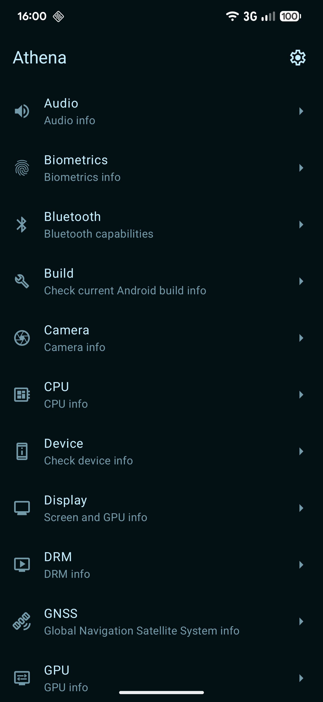
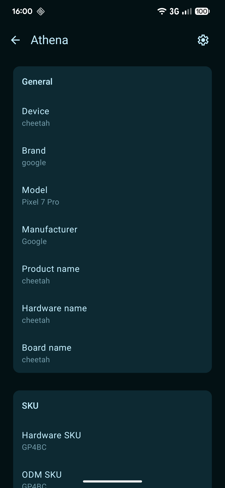
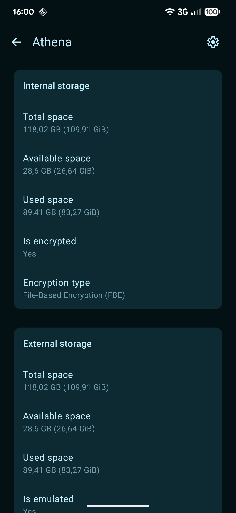
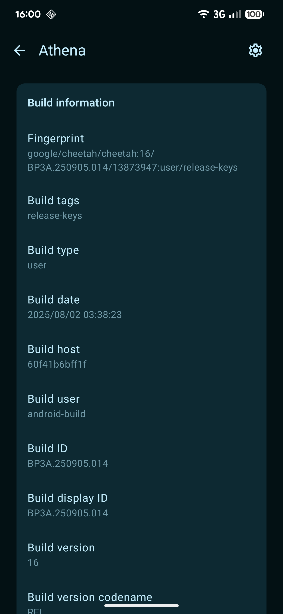

# Athena

[](https://crowdin.com/project/athena-android)

Open source Material You Android device info app

<p float="left" align="middle">
    
    
    
    
</p>

## Building

Either use Android Studio or
[build the app from the command line](https://developer.android.com/studio/build/building-cmdline)

You can find builds made from the latest commit
[here](https://github.com/SebaUbuntu/Athena/releases/tag/latest)

## Installation

Sideload the built APK

## Contribute

[Pull requests are always welcome](https://github.com/SebaUbuntu/Athena/pulls)

If you find a bug, [open an issue](https://github.com/SebaUbuntu/Athena/issues)

## License

```
#
# SPDX-FileCopyrightText: Sebastiano Barezzi
# SPDX-License-Identifier: Apache-2.0
#
```
